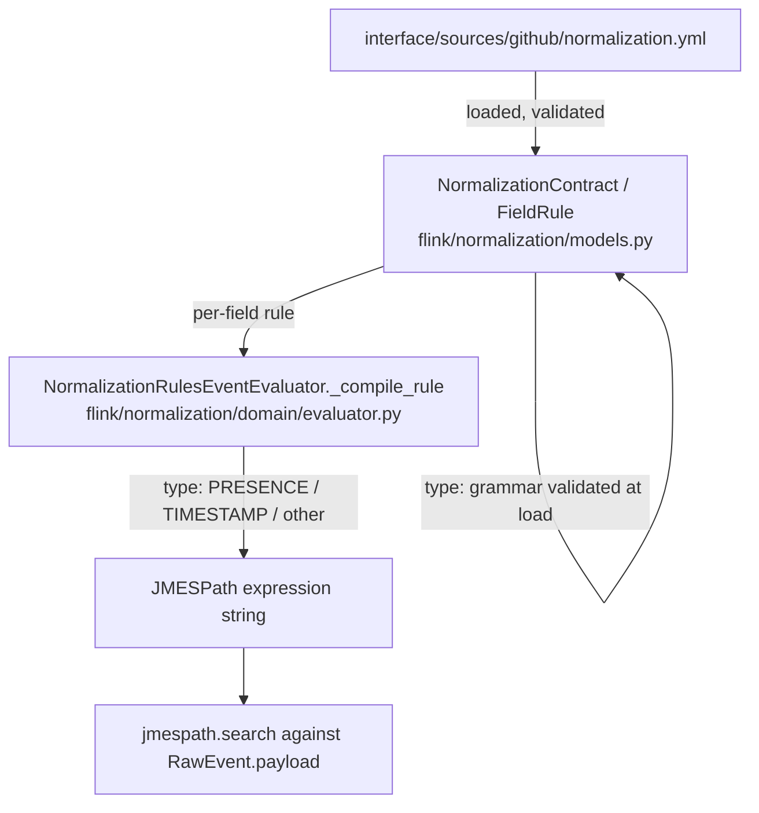

# Conviction Index Foundations Design

**Spec**: `.specs/features/conviction-index-foundations/spec.md`
**Status**: Approved (P1 scope only - P2-P6 get their own Design pass when picked up, per the spec's
formalized order)

**Design-pairing gate**: followed per `.claude/mentor-design-pairing.md`'s standard handshake
(analyse/propose → Stop Point 1 structure approval → Stop Point 2 task-list approval), both
approved by the user 2026-08-28. This is the lighter of the two gates the project has on file - not
the deeper "user proposes structure first" variant `AD-007` describes, which lives in and is
invoked through `technical-learning-mentor` (not triggered this session).

---

## Scope of this design pass

Only **P1** (normalization contract gains explicit field types; `as:` is removed). P2-P6 are listed
in `spec.md` with their own dependency notes but are out of scope for this `design.md` - each gets
its own Design phase when its turn comes, per the spec's formalized pick-up order.

---

## Architecture Overview

No new component, service, or file layout change. This is a contract-format and compiler change
inside two existing files:



---

## Code Reuse Analysis

### Existing Components to Leverage

| Component | Location | How to Use |
| --- | --- | --- |
| `FieldRule` (Pydantic model, `extra="forbid"`) | `flink/normalization/models.py` | Extend: remove `as_`, add `type: str` + validator. `extra="forbid"` already rejects an unknown `as:` key for free once the field is deleted from the model - no new rejection logic needed |
| `FROM_PATTERN` regex-validator pattern | `flink/normalization/models.py:7,18-25` | Same shape reused for the new `type:` grammar validator - a compiled regex + `field_validator` |
| `NormalizationRulesEventEvaluator._compile_rule`'s `match rule:` structure | `flink/normalization/domain/evaluator.py:67-86` | Extend the existing `match`/`case` arms - swap `as_="boolean"`/`as_="timestamp"` cases for `type="PRESENCE"`/`type="TIMESTAMP"`, everything else keeps falling into the existing `case _:` passthrough |
| `Pydantic.BaseModel.model_fields_set` (library feature, no new code) | n/a | Distinguishes "field explicitly provided in the input" from "field defaulted" - exactly the `default: null` vs. absent distinction the spec requires, with no custom sentinel needed |
| `tests/flink/normalization/test_contracts_github.py`'s exact-set-equality assertions | `tests/flink/normalization/` | Existing test already asserts every GitHub event type's field set against `spec.md` - re-run unmodified after the `github.yml` migration to verify T3's "identical output" requirement (CVF-08) |

### Integration Points

| System | Integration Method |
| --- | --- |
| `NormalizationContract` (unchanged) | `FieldRule` is a nested model inside it - the `type:` grammar validator runs automatically whenever a contract loads via `get_contract` |
| `FlinkNormalizationPipeline` / `NormalizationFlatMapFunction` (unchanged) | No changes - they call `EventEvaluator.apply()`, which is unaffected; only `_compile_rule`'s internal branching changes |

---

## Components

### `FieldRule.type` grammar validator

- **Purpose**: Accept and validate a `type:` declaration against a fixed grammar; reject anything
  else at contract-load time with a clear error naming the offending token.
- **Location**: `flink/normalization/models.py`
- **Interfaces**:
  - A compiled regex implementing:
    `type := SCALAR | "ARRAY<" SCALAR ">"`
    `SCALAR := STRING | BOOLEAN | PRESENCE | TIMESTAMP | BIGINT | INT | DOUBLE`
  - `FieldRule.type: str` (required, no default) + `@field_validator("type")` raising `ValueError`
    with the invalid token named, on a grammar mismatch
- **Dependencies**: None new (Pydantic, `re` - both already used in this file)
- **Reuses**: `FROM_PATTERN`'s validator shape (`field_validator` + `ValueError` on mismatch)

### `NormalizationRulesEventEvaluator._compile_rule` (extended)

- **Purpose**: Compile a `FieldRule` into a JMESPath expression string, now driven by `type:`
  instead of `as_`.
- **Location**: `flink/normalization/domain/evaluator.py`
- **Interfaces**: `_compile_rule(rule: FieldRule) -> str` (signature unchanged)
  - The leading `if rule.expression: return rule.expression` branch is removed - `expression:` no
    longer exists on `FieldRule`
  - `case FieldRule(type="PRESENCE")` → `f"{rule.from_} != \`null\`"` (was `as_="boolean"`)
  - `case FieldRule(type="TIMESTAMP")` → `f"iso_to_millis({rule.from_})"` (was `as_="timestamp"`)
  - Every other `type:` value (`STRING`, `BOOLEAN`, `BIGINT`, `INT`, `DOUBLE`, `ARRAY<...>`) falls
    into the existing `case _:` (plain `from_` passthrough) or the existing
    `case FieldRule(take=take)` (list-pluck) - unchanged
  - `default` composition: `if "default" not in rule.model_fields_set:` replaces
    `if rule.default is None:`
- **Dependencies**: `FieldRule` (T1)
- **Reuses**: The method body's two `case` arms and the `default` check line - unchanged from
  before this feature

---

## Data Models

### `FieldRule` (modified)

```python
class FieldRule(BaseModel):
    model_config = ConfigDict(extra="forbid")
    from_: Optional[str] = Field(default=None, alias="from")
    take: Optional[str] = Field(default=None)
    type: str  # NEW - required, no default, grammar-validated
    default: Optional[Any] = Field(default=None)
    # as_ REMOVED
    # expression REMOVED
```

No change to `NormalizationContract`, `NormalizedEvent`, or `RawEvent`.

**Relationships**: unchanged - `NormalizationContract.{partition_key,envelope,common,event_types}`
still hold `FieldRule` values; only the shape of `FieldRule` itself changes.

---

## Error Handling Strategy

| Error Scenario | Handling | User Impact |
| --- | --- | --- |
| `type:` missing on a field | Pydantic raises `ValidationError` (required field with no default) | Contract fails to load; error names the missing field's path |
| `type:` present but grammar-invalid (unknown scalar token, malformed `ARRAY<...>`) | `field_validator` raises `ValueError`, Pydantic wraps it into `ValidationError` | Error message includes the offending token and the field path (Pydantic's standard error context) |
| Contract declares `as:` | `extra="forbid"` raises `ValidationError` (unknown field) - no new code, inherited from the model already rejecting unknown keys | Standard Pydantic "extra fields not permitted" error naming `as` |
| Contract declares `expression:` | `extra="forbid"` raises `ValidationError` (unknown field) - same mechanism as `as:` | Standard Pydantic "extra fields not permitted" error naming `expression` |

---

## Risks & Concerns

| Concern | Location (file:line) | Impact | Mitigation |
| --- | --- | --- | --- |
| Manual migration of ~30 fields in `github.yml` (8 `as: timestamp`, 1 `as: boolean`, ~21 untyped) risks a missed/mistyped field | `interface/sources/github/normalization.yml` | A silently wrong or missing `type:` would either fail contract load (missing case) or, worse, compile a field with the wrong transform (mistyped `PRESENCE` vs `TIMESTAMP` case) | `type:` is now mandatory, so a missed field fails contract load loudly (not silent); `tests/flink/normalization/test_contracts_github.py`'s exact-set-equality assertions catch a field whose *value* changed due to a wrong transform choice, since the test compares against `spec.md`'s field values, not just presence |
| `.claude/rules/flink-contract-dsl.md`'s `default: is not None` guidance becomes stale the moment T2 lands | `.claude/rules/flink-contract-dsl.md` | A future contributor reading the rule file would apply the now-wrong guidance to new code | T4 updates the rule file in the same feature, not deferred |

> No other concerns found in the reviewed code paths (`models.py`, `domain/evaluator.py`) beyond
> what's listed above.

---

## Tech Decisions

| Decision | Choice | Rationale |
| --- | --- | --- |
| Type representation | Plain string, grammar-validated at load, not parsed into a structured AST | See Stop Point 1 discussion in chat - matches the project's incremental-MVP philosophy (`STATE.md` note under `AD-006`, `PLATFORM.md`); no consumer needs the parsed structure until a future DDL generator exists |
| Type grammar scope | Scalars and `ARRAY<scalar>` only - no nested/object shapes | The type vocabulary only needs to describe values a `FieldRule` can actually produce; nesting is YAGNI until a real case demands it |
| `default: null` vs. absent distinguishability mechanism | `Pydantic.BaseModel.model_fields_set` | Native Pydantic mechanism, no custom sentinel type needed - stricter and simpler than the project's prior `is not None` convention |
| `PRESENCE` vs. `BOOLEAN` as two distinct type tokens | Kept separate (not inferred from data shape) | Resolves a real ambiguity found during Specify: `public` (native JSON boolean, no transform) and `issue_is_pull_request` (presence-of-field boolean, today's `as: boolean`) cannot share one token without the compiler guessing from the payload's actual shape |

> **Project-level decision to record**: the `default` distinguishability mechanism
> (`model_fields_set` over `is not None`) amends `.claude/rules/flink-contract-dsl.md`'s existing
> guidance - done in T4, not a new `AD-NNN` (it's a rule-file-local convention, not a
> project-decisions-log-level architectural call).
