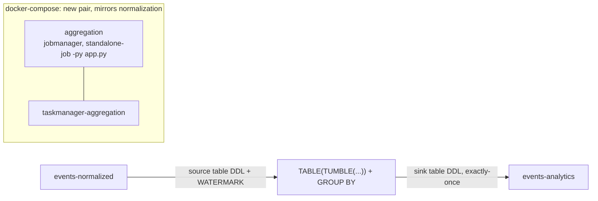

# Flink Aggregation Design

**Spec**: `.specs/features/flink-aggregation/spec.md`
**Status**: Approved

**Design pairing**: not skipped. Structure and task list both went through `.claude/mentor-design-pairing.md`'s handshake in conversation — STOP POINT 1 (structure) and STOP POINT 2 (task list) both confirmed by the user on 2026-08-24, before this file was written.

---

## Architecture Overview

One Flink SQL job, deployed as its own jobmanager/taskmanager pair (mirroring `flink-normalization`'s deploy shape per `AD-005`), reads `events-normalized` as a Table API source table, applies a 5-minute tumbling window keyed by `partition_key` with a bounded-out-of-orderness watermark, and writes one row per closed window to a new `events-analytics` topic via an exactly-once Kafka sink.

Per `AD-009`, there is no YAML contract compiling to this SQL — the `.sql` file itself (three statements: source `CREATE TABLE`, sink `CREATE TABLE`, windowed `INSERT INTO ... SELECT`) is the declarative contract, authored directly.

---

## Code Reuse Analysis

### Existing Components to Leverage

| Component | Location | How to Use |
| --- | --- | --- |
| Flink `Dockerfile` pattern (base image + Kafka SQL connector JAR + `usrlib` layout) | `flink/normalization/Dockerfile` | Copy-and-adapt for `flink/aggregation/Dockerfile` — the JAR download step is already there and unused by normalization's DataStream job; this feature is its first real consumer |
| `standalone-job -py` jobmanager + dedicated taskmanager compose pattern | `infra/docker/docker-compose.yml` (`normalization`/`taskmanager` services) | Copy-and-adapt into `aggregation`/`taskmanager-aggregation` |
| Topic provisioning convention | `infra/docker/scripts/create-topics.sh` | Add `events-analytics` to the `TOPICS` array — same partitions/replication/retention as the other two topics |
| `shared/logger.py` (`setup_logging`) | `shared/logger.py` | Same per-class logger pattern in `flink/aggregation/app.py` |
| `.env` / `dotenv` load + `KAFKA_BOOTSTRAP_SERVERS` env var pattern | `flink/normalization/app.py` | Same shape in `flink/aggregation/app.py` |
| Config-selects-behavior pattern (`python -m ingestion.app --source github`) | `ingestion/app.py` | `flink/aggregation/app.py` reads *which* query to run from an env var (`AGGREGATION_QUERY_FILE`) instead of hardcoding a filename — same principle, different mechanism (env var, since this runs inside a container without CLI args) |

### Explicitly NOT Reused

| Component | Location | Why not |
| --- | --- | --- |
| `flink/common/adapters/{source,sink}.py`, `KafkaFactory`, `EventSourcePort`/`EventSinkPort` | `flink/common/` | These build DataStream API `KafkaSource`/`KafkaSink` objects. The Table API does not consume them — it connects via `CREATE TABLE ... WITH (...)` DDL, a different mechanism entirely. `flink/common` stays DataStream-only, used only by `flink/normalization`. |
| `flink/normalization/sources/github.yml` (as a DDL source) | `flink/normalization/sources/github.yml` | Considered and rejected during Design (see Tech Decisions) — it has no SQL type information and varies per `event_type`, which the P1 query does not need. `flink/normalization/models.py`'s `NormalizedEvent` (the fixed envelope shape) is the correct reference for the 2 columns P1's source DDL needs, consulted by hand, not read programmatically. |

---

## Components

### `flink/aggregation/app.py`

- **Purpose**: Generic Flink SQL script runner. Bootstraps a `StreamExecutionEnvironment`/`StreamTableEnvironment`, configures checkpointing (interval + state backend), reads the `.sql` file named by `AGGREGATION_QUERY_FILE`, splits it into statements, executes each via `execute_sql()`. Never references a specific query by name — a future second query is a new `.sql` file plus a new `docker-compose.yml` service block pointing `AGGREGATION_QUERY_FILE` at it, with zero change to this file.
- **Location**: `flink/aggregation/app.py`
- **Interfaces**: none exposed (a `__main__` entrypoint, like `flink/normalization/app.py`)
- **Dependencies**: `KAFKA_BOOTSTRAP_SERVERS`, `AGGREGATION_QUERY_FILE` env vars; `shared.logger.setup_logging`
- **Reuses**: `shared/logger.py`, the `.env`/dotenv-load shape of `flink/normalization/app.py`

### `flink/aggregation/queries/repo_counts_5m.sql`

- **Purpose**: The P1 contract (`AD-009`) — source table DDL with watermark, sink table DDL with exactly-once sink options, and the windowed `INSERT INTO ... SELECT`. Self-contained: opening this one file shows the query end to end.
- **Location**: `flink/aggregation/queries/repo_counts_5m.sql`
- **Not Python** — pure data, per `AD-009`.

### `flink/aggregation/Dockerfile`

- **Purpose**: Same base image (`flink:2.3.0-scala_2.12-java17`) and Kafka SQL connector JAR download as `flink/normalization/Dockerfile`. Copies `flink/aggregation/` and `shared/` only — does **not** copy `flink/common/` (unused by a Table API job).
- **Location**: `flink/aggregation/Dockerfile`
- **Reuses**: `flink/normalization/Dockerfile`'s structure

### `infra/docker/docker-compose.yml` additions

- **`aggregation`**: jobmanager, `standalone-job -py flink/aggregation/app.py`, `KAFKA_BOOTSTRAP_SERVERS`, `AGGREGATION_QUERY_FILE=repo_counts_5m.sql`, `depends_on: topic-init: condition: service_completed_successfully`
- **`taskmanager-aggregation`**: `depends_on: aggregation`

### `infra/docker/scripts/create-topics.sh`

- **Purpose**: Add `"events-analytics"` to the `TOPICS` array — same partitions/replication-factor/retention as `events-raw`/`events-normalized`.

---

## Data Models

No Python data model — the `CREATE TABLE` column lists inside `repo_counts_5m.sql` **are** the schema, per `AD-009`. For reference, the source table's 2 relevant columns map onto `flink/normalization/models.py`'s `NormalizedEvent`:

| Source column (P1) | `NormalizedEvent` field | SQL type |
| --- | --- | --- |
| `partition_key` | `partition_key: str` | `STRING` |
| `event_time` | `event_time: int` (epoch millis) | `BIGINT`, converted to `TIMESTAMP_LTZ` for the watermark |

Sink table columns (the output row, per spec's Assumptions): `repo_name` (aliased from `partition_key` in the `SELECT`), `window_start`, `window_end`, `event_count`.

---

## Error Handling Strategy

| Error Scenario | Handling | User Impact |
| --- | --- | --- |
| Malformed/schema-incompatible row from `events-normalized` | Source table's JSON format connector option to skip-and-log (exact option name TBD — verify against Flink 2.3 docs in Execute) | Row skipped, job continues (FLA-06) |
| Event arrives past the watermark | Dropped by Flink's window/watermark mechanics, no code needed | Not counted, no error (FLA-05) |
| Job crash mid-window | Checkpoint restore | Window's partial count resumes from the checkpoint, not from zero (FLA-07) |
| Job restart after a window was already published | Exactly-once Kafka transactional sink | No duplicate row in `events-analytics` (FLA-08) |
| Sink's transaction timeout exceeds the broker's `transaction.max.timeout.ms` | Kafka refuses to open the transaction | Job fails fast at startup with a clear error, not at an arbitrary point in the stream |

---

## Risks & Concerns

| Concern | Location | Impact | Mitigation |
| --- | --- | --- | --- |
| Exact PyFlink Table API / SQL connector option names not yet verified against Flink 2.3 docs (`json.ignore-parse-errors`, `sink.delivery-guarantee`, `sink.transactional-id-prefix`) | `flink/aggregation/queries/repo_counts_5m.sql` (to be written) | Risk of wrong config or a job that silently misbehaves | Knowledge Verification Chain research step during Execute, before finalizing the `.sql`; live docker verification (T6) is the real gate regardless |
| PyFlink `TableEnvironment`'s exact API for running a multi-statement `.sql` file not yet confirmed (per-statement `execute_sql()` loop assumed, not verified) | `flink/aggregation/app.py` (to be written) | Same as above | Same as above |
| Flink transaction timeout default vs. the broker's `transaction.max.timeout.ms` — `infra/docker/docker-compose.yml`'s `broker-1..3` have no override, so the broker uses Kafka's own default (believed ~15 min; Flink's connector default is believed much higher, ~1 hour) | `infra/docker/docker-compose.yml` (`broker-1`, `broker-2`, `broker-3`) | Sink may fail to open a transaction if the sink's configured timeout exceeds the broker's max | Set `transaction.timeout.ms` explicitly on the sink, below the broker's max, confirmed with real values during Execute — already an Edge Case in `spec.md` |
| No automated test coverage for the windowing/watermark/exactly-once behavior itself | n/a — accepted trade-off | A regression here is only caught by live verification, not CI | Accepted per the user's explicit test-strategy decision; T6's live docker-compose verification is the gate, same posture as `flink-normalization`'s T19 |

> No fragile/tech-debt/security findings in the code this feature touches beyond the above — `flink/common`, `flink/normalization` were read during Design and nothing new surfaced past what `STATE.md`'s Handoff already tracks.

---

## Tech Decisions (feature-local; project-wide ones are `AD-009`/`AD-010` in `STATE.md`)

| Decision | Choice | Rationale |
| --- | --- | --- |
| Granularity of the `.sql` contract | One file per query, bundling source DDL + sink DDL + `INSERT INTO...SELECT` | Keeps "the `.sql` file is the contract" (`AD-009`) a self-contained unit; revisit if a second query needs to share tables with the first |
| `app.py` shape | Generic SQL-script runner; query file selected via `AGGREGATION_QUERY_FILE` env var, never hardcoded | Mirrors `ingestion/app.py`'s `--source` pattern; a new query never requires a Python change (`AD-006`'s test, applied to queries) |
| Cluster topology | Separate jobmanager/taskmanager pair, not a shared session cluster | Matches `AD-005`'s per-service philosophy and `flink-normalization`'s existing deploy pattern; avoids introducing a second deploy model (session-cluster job submission) in the same feature |
| Source table DDL | Hand-written (envelope + `partition_key` columns only), not derived from `flink/normalization/sources/github.yml` | P1's query never touches `event_types` columns; `github.yml` has no SQL-type vocabulary and would need a union-of-all-types scheme this feature doesn't exercise. Revisit if a future query needs per-type fields. |
| Test strategy | Live `docker compose` verification only (T6); no PyFlink `MiniCluster`/testcontainers harness | Real logic lives in the SQL, not in Python; building a heavy test harness for one count query has low learning payoff relative to effort |
