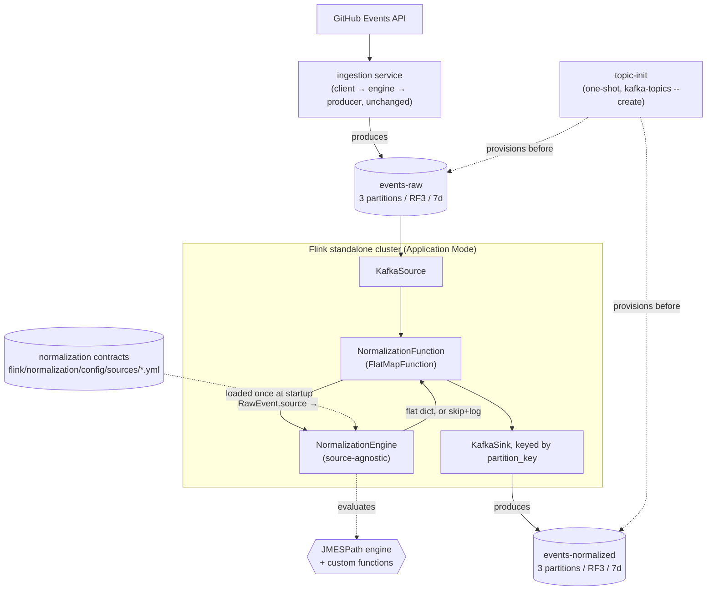

# Flink Normalization Design

**Spec**: `.specs/features/flink-normalization/spec.md`
**Context**: `.specs/features/flink-normalization/context.md`
**Platform vision**: `.specs/PLATFORM.md` (`AD-006`)
**Status**: Approved - revised 2026-08-17 for contract-driven normalization (`AD-006`). `tasks.md`
Phases 3-6 were regenerated against this revision (29 tasks → 22); Phases 1-2 (T1-T4) are done and
unaffected. Execute is in progress, past T11 (contract loader + engine + evaluator all implemented) as
of 2026-08-18.

> **Naming/path drift note (added 2026-08-18, not re-litigated - transcription only)**: the code that
> shipped for T5/T9/T10/T11 uses different names and file paths than this document describes below.
> The document's *shape* (a port + a source-agnostic interpreter + a cached contract loader) still
> matches; only labels changed:
> | This document says | Actual code |
> | --- | --- |
> | `NormalizationEngineBase` (`flink/normalization/ports.py`) | Split into two ABCs: `NormalizationEngineBase` (orchestrates a contract into a flat dict) and `NormalizationEvaluatorBase` (compiles+evaluates one `FieldRule` against a payload) - same file |
> | `NormalizationEngine` (`flink/normalization/adapters/engine.py`) | `NormalizationEngine` (`flink/normalization/adapters/engine.py`) implements `NormalizationEngineBase`; the compile/evaluate half moved to `NormalizationJmespathEvaluator` (`flink/normalization/adapters/evaluator.py`), which also hosts the `iso_to_millis` custom JMESPath function (this doc had it as a standalone `flink/normalization/functions.py`) |
> | `get_normalization_contract(source)` | `get_contract(source)` - same shape (`@lru_cache`, `NotImplementedError` on unknown source), `flink/normalization/models.py` |
> | `flink/normalization/config/sources/<source>.yml` | `flink/normalization/config/sources/<source>.yml` |
> | `flink/normalization/job.py` / `app.py` (`NormalizationFunction`) | Not built yet - `flink/normalization/app.py` today only has a `__main__` smoke-test block reading `event_sample.json` directly, no `FlatMapFunction`/Kafka wiring (that's T15/T16 in `tasks.md`, still open) |
> Not re-derived below since it doesn't change any behavioral decision - see `tasks.md` and
> `.specs/STATE.md` Handoff for the current, accurate task-by-task status.

---

## Architecture Overview

Two new runtime pieces join the existing 3-controller/3-broker Kafka cluster: the ingestion service (containerized for the first time) and a standalone PyFlink cluster running one job, `flink.normalization`, in **Application Mode** - the job is embedded in the JobManager's entrypoint, so it starts the instant `docker compose up` runs, with no separate submission step (confirmed with the user 2026-08-10; a session-cluster-plus-submitter alternative is recorded as a future improvement, not built now - see Tech Decisions and `context.md`).

Data flow: `GitHub Events API → ingestion (client/engine/producer, unchanged) → events-raw → Flink (KafkaSource → NormalizationFunction → KafkaSink) → events-normalized, keyed by partition_key`.

**Normalization is contract-driven** (`AD-006`, `.specs/PLATFORM.md`). There is no hand-written
`GitHubNormalizer` with one Python method per event type. Instead, a single source-agnostic
`NormalizationEngine` interprets a YAML contract that declares, per source and per event type, which
output field comes from which input path. Adding an event type - or a whole new source - is a YAML
edit, not a Python change. The declared paths compile to JMESPath expressions evaluated against
`RawEvent.payload`.



---

## Code Reuse Analysis

### Existing Components to Leverage

| Component | Location | How to Use |
| --- | --- | --- |
| `RawEvent` | `shared/models.py` | Imported directly as the Flink job's input contract - not redefined. `RawEvent.payload` holds the whole source event dict (`actor`, `repo`, `org`, `created_at`, `public`, and the source's own nested `payload`), which is the root every contract path is evaluated against. |
| **YAML-config-plus-Pydantic-validator pattern** | `ingestion/models.py` + `ingestion/config/sources.yml` (`SourceYamlEntry`, `_load_yaml_config`, `@lru_cache`) | **The direct precedent for this feature's contract layer.** Same shape reused: a Pydantic model validates each YAML entry, one cached loader reads the file once, and a lookup function resolves an entry by name. The normalization contract is the same idea applied to field mapping instead of endpoints. |
| Dotted-path field resolution | `ingestion/models.py` (`SourceConfig._get_nested_value`, `id_field`/`type_field`) | Conceptually extended, not imported: ingestion needed two hardcoded single-value paths, so a hand-rolled `split(".")` walk was enough. Normalization needs list projection, defaults, and presence checks, so the same *idea* is delegated to JMESPath rather than growing `_get_nested_value` (see Tech Decisions). |
| ABC + constructor-injection port pattern | `ingestion/ports.py` | Applied identically to `NormalizationEngineBase` - one abstract method, docstring-documented like `IngestionEngineBase`. Retained as the escape hatch for a source too irregular for a contract (see `AD-004` amendment note under Components). |
| Log-and-skip validation pattern | `ingestion/adapters/engine.py` (`_format_events`) | Mirrored in `NormalizationFunction.flat_map` for malformed messages / unknown `schema_version` / unregistered source. |
| Per-class logger convention | `shared/logger.py` | Reused as-is in every new module (`getLogger(self.__class__.__name__)`). |
| `infra/docker/docker-compose.yml` | `infra/docker/docker-compose.yml` | Extended in place - new services added alongside the existing controllers/brokers/kafka-ui, not a new compose file. |
| `.env` / `KAFKA_BOOTSTRAP_SERVERS` convention | `ingestion/adapters/producer.py`, `ingestion/app.py` | Same env var read by the Flink job's `app.py` for its Kafka source/sink bootstrap servers. |
| Makefile `@echo` + one-liner target style | `Makefile` | New targets (e.g. `stack-up`) follow the same shape as `kafka-up`/`ingestion-default`. |

### Integration Points

| System | Integration Method |
| --- | --- |
| `events-raw` (Kafka) | PyFlink `KafkaSource`, dedicated consumer group (e.g. `flink-normalization`), starting offset configurable (latest by default for a continuously-running job) |
| `events-normalized` (Kafka) | PyFlink `KafkaSink`, message key = `partition_key` via `KafkaRecordSerializationSchema`'s key extractor, value = flat JSON string |
| Existing ingestion service | Becomes a docker-compose service producing to the same `events-raw` topic it already writes to today - **no code change to `ingestion/` itself** |

---

## Components

### `NormalizationEngineBase` (port)

- **Purpose**: Abstract contract for turning a validated `RawEvent` into the pipeline's flat normalized record - one implementation per source, per `AD-004`.
- **Location**: `flink/normalization/ports.py`
- **Interfaces**:
  - `normalize(self, event: RawEvent) -> dict[str, Any]` - returns the flat normalized record (Domain-Neutral Envelope fields + source-specific fields). Never raises for a structurally valid `RawEvent`; never returns `None` - an event of an unmapped type still returns a full record with empty source-specific fields (spec.md P1 Normalization AC5).
- **Dependencies**: `shared.models.RawEvent`
- **Reuses**: Same ABC shape as `IngestionEngineBase`/`IngestionClientBase`/`IngestionProducerBase` in `ingestion/ports.py`

> **`AD-004` amendment (recorded 2026-08-17 alongside `AD-006`).** `AD-004` required "one concrete
> implementation per source." Under a contract-driven design that mechanism is superseded for the
> normalization layer: there is **one** concrete implementation for **all** sources, and what varies
> per source is the contract, not the class. `AD-004`'s *principle* is unchanged and in fact better
> served - zero source-specific vocabulary reaches shared pipeline code, since no source-specific
> code exists at all. `NormalizationEngineBase` is retained so a source too irregular for a declarative
> contract can still get a hand-written Python implementation, but that is the exception, not the
> default path.

### `NormalizationEngine`

- **Purpose**: The single, source-agnostic `Normalizer` this feature builds. Interprets a validated normalization contract to produce the flat normalized record for any source. Contains **no** GitHub-specific logic, no per-event-type methods, and no `if source == ...` branching.
- **Location**: `flink/normalization/adapters/engine.py`
- **Interfaces**:
  - `normalize(self, event: RawEvent) -> dict[str, Any]` - satisfies `NormalizationEngineBase`.
- **Behavior** (signature level; body is Execute-time):
  1. Resolve the contract for `event.source`; resolve the per-event-type field block for `event.source_event_type`, falling back to an empty block when that type is not declared (spec.md P1 AC5 - the event still publishes).
  2. Evaluate the envelope fields, the source-common block, and the per-type block by running each field's compiled expression against `RawEvent.payload`.
  3. Return envelope + source-specific fields as one flat dict.
- **Dependencies**: `shared.models.RawEvent`, the contract loader, the JMESPath engine
- **Reuses**: `spec.md`'s Normalization Mapping table remains the binding contract for *what* the fields are - it becomes the content of the YAML files rather than the content of Python methods.

### Contract loader + compiler

- **Purpose**: Read the YAML contracts, validate them with Pydantic, and compile each declared field into an executable expression once at startup (not per message - the job processes a continuous stream, so per-record recompilation would be pure waste).
- **Location**: `flink/normalization/models.py`
- **Interfaces**:
  - A Pydantic model per contract level (contract file → envelope block, common block, per-event-type blocks → field declaration), mirroring how `SourceYamlEntry` validates `sources.yml`.
  - `get_normalization_contract(source: str) -> NormalizationContract` - cached lookup by source name, mirroring `ingestion.models.get_source_config`'s shape (`@lru_cache` + `NotImplementedError` on unknown source).
- **Compilation rule** - each field declaration translates to exactly one JMESPath expression:

  | Contract declaration | Compiles to | Verified |
  | --- | --- | --- |
  | `from: actor.id` | `actor.id` | ✅ `181008794` |
  | `from: payload.issue.labels` + `take: name` | `payload.issue.labels[].name` | ✅ list of label names |
  | `from: payload.issue.pull_request` + `as: boolean` | ``payload.issue.pull_request != `null` `` | ✅ `True` |
  | `from: created_at` + `as: timestamp` | `iso_to_millis(created_at)` (custom function) | ✅ `1784290892000` |
  | `from: org.id` + `default: null` | native null-on-missing, or `\|\|` when a non-null default is given | ✅ returns `None`, never raises |
  | `expression: <raw>` | passed through verbatim | escape hatch, `AD-006` |

- **Reuses**: `ingestion/models.py`'s YAML-plus-Pydantic-plus-`lru_cache` shape, applied to a richer schema.
- **Note**: the vocabulary (`take:`, `as:`) exists to keep JMESPath syntax out of the user's way, not to add capability - every row above except `as: timestamp` is native engine behavior (see `.specs/PLATFORM.md`, verified findings).

### Normalization contracts (the YAML itself)

- **Purpose**: The user-authored declaration. One file per source.
- **Location**: `flink/normalization/config/sources/github.yml`
- **Shape** (illustrative - the authoritative field list stays `spec.md`'s Normalization Mapping table):

```yaml
source: github
partition_key: { from: repo.name }

envelope:
  actor_id:    { from: actor.id }
  actor_login: { from: actor.login }
  event_time:  { from: created_at, as: timestamp }

common:                      # applies to every event type of this source
  repo_id:   { from: repo.id }
  repo_name: { from: repo.name }
  org_id:    { from: org.id }
  org_login: { from: org.login }
  public:    { from: public }

event_types:
  IssueCommentEvent:
    action:                { from: payload.action }
    issue_id:              { from: payload.issue.id }
    issue_labels:          { from: payload.issue.labels, take: name }
    issue_is_pull_request: { from: payload.issue.pull_request, as: boolean }
    comment_body:          { from: payload.comment.body }
  # ... the remaining declared types
```

- **Note on paths**: every path is evaluated against `RawEvent.payload`, which is the whole source event dict. GitHub's own nested `payload` object is therefore reached as `payload.<...>`, while `actor`/`repo`/`org`/`created_at`/`public` sit at the root - matching the shapes verified against `flink/normalization/event_sample.json`.

### `NormalizationFunction` (Flink `FlatMapFunction`)

- **Purpose**: The only Flink-aware piece of business logic. Parses/validates the raw Kafka message into a `RawEvent`, delegates to the `NormalizationEngine`, and yields the flat normalized JSON string - or yields nothing (logging why) on any failure. A **`FlatMapFunction`**, not a `MapFunction`, specifically because "skip this message" (zero output records) is a required outcome (spec.md P1 Normalization AC6) that a `MapFunction` cannot express (it must always emit exactly one record).
- **Location**: `flink/normalization/job.py`
- **Interfaces**:
  - `flat_map(self, value: str) -> Iterator[str]`
- **Behavior** (described at signature level; body is implementation, left to Execute):
  1. Parse `value` as JSON and validate against `RawEvent`. On failure (bad JSON, missing field, or `schema_version != 1`): log and yield nothing.
  2. Call `normalizer.normalize(event)`. If no contract is declared for `event.source`: log and yield nothing (a gap spec.md didn't explicitly enumerate - closed here, see Risks & Concerns).
  3. `json.dumps` the result and `yield` it.
- **Dependencies**: `RawEvent`, `NormalizationEngine`, `shared.logger`
- **Reuses**: Same log-and-skip shape as `ingestion/adapters/engine.py`'s `_format_events`

### Job wiring (`flink/normalization/app.py`)

- **Purpose**: Builds the `StreamExecutionEnvironment`, wires `KafkaSource(events-raw) → NormalizationFunction → KafkaSink(events-normalized, keyed by partition_key)`, and executes the job. This is the Application Mode entrypoint (`standalone-job -py /opt/flink/usrlib/app.py`).
- **Location**: `flink/normalization/app.py`
- **Dependencies**: PyFlink (`pyflink.datastream`, `pyflink.datastream.connectors.kafka`), `job.NormalizationFunction`, Flink's Kafka connector JAR (added to the image's `/opt/flink/lib`, not a `pip` package - PyFlink connectors need the Java connector on the classpath)
- **Reuses**: `.env`/`load_dotenv()` + `KAFKA_BOOTSTRAP_SERVERS` convention already used by `ingestion/app.py`/`ingestion/adapters/producer.py`

### Docker / compose additions

| File | Purpose |
| --- | --- |
| `infra/docker/flink/Dockerfile` | `FROM flink:2.3.0-scala_2.12-java17`; installs Python 3.12 + `apache-flink==2.3.0` + `jmespath`; adds the Flink Kafka connector JAR; copies `flink/normalization/` (including its `config/*.yml` contracts) and `shared/models.py` into the image's usrlib path. **No longer copies `ingestion/models.py`** - the contract-driven design removes the cross-package dependency on `ingestion/` entirely; `shared.models.RawEvent` is the only shared import left |
| `ingestion/Dockerfile` | Slim Python base; installs `requirements/ingestion.txt`; `CMD ["python", "-m", "ingestion.app", "--source", "github"]` |
| `infra/docker/scripts/create-topics.sh` | One-shot script: retries `kafka-topics.sh --create` for `events-raw`/`events-normalized` (3 partitions, RF3, 7-day retention) against `broker-1:19092` until brokers accept connections, then exits 0 |
| `infra/docker/docker-compose.yml` | Extended (not replaced): new `topic-init`, `ingestion`, `flink-jobmanager`, `flink-taskmanager` services. Startup ordering: brokers → `topic-init` → {`ingestion`, `flink-jobmanager`} → `flink-taskmanager` |

---

## Data Models

### Domain-Neutral Envelope (see `spec.md` Normalization Mapping for the authoritative field table)

```python
class NormalizationEngineBase(ABC):
    @abstractmethod
    def normalize(self, event: RawEvent) -> dict[str, Any]:
        """Flatten a validated RawEvent into the pipeline's common normalized record.

        Args:
            event (RawEvent): A structurally valid RawEvent (already deserialized
                and schema_version-checked by the caller).

        Returns:
            dict[str, Any]: The Domain-Neutral Envelope fields plus this source's
                fields block. Always returns a full record, even for an
                event_type this normalizer doesn't yet have a specific mapping
                for (envelope populated, source-specific fields empty/null).
        """
```

**Relationships**: `RawEvent` (input, `shared/models.py`, unchanged) → `NormalizationEngineBase.normalize()` → flat `dict[str, Any]` (output, serialized to JSON and published to `events-normalized`). No Pydantic model describes the *output* shape - it is data-dependent by design, since the contract determines which fields exist. `spec.md`'s Normalization Mapping table is the binding specification of that shape.

### Contract models (new)

Pydantic models validate the *contract*, not the event. This is the one place Pydantic classes are
added - and note they are written by developers to define the contract's grammar, never instantiated
by the user, who only writes YAML (`AD-006`).

```python
class FieldRule(BaseModel):
    """One declared output field. Exactly one of `from_`/`expression` is required."""
    from_: str | None = Field(default=None, alias="from")
    take: str | None = None          # pluck this attribute from a list of objects
    as_: Literal["boolean", "timestamp"] | None = Field(default=None, alias="as")
    default: Any = None
    expression: str | None = None    # raw-JMESPath escape hatch (AD-006)


class NormalizationContract(BaseModel):
    source: str
    partition_key: FieldRule
    envelope: dict[str, FieldRule]
    common: dict[str, FieldRule]
    event_types: dict[str, dict[str, FieldRule]]
```

**Validation is the platform's contract with a non-technical author**: an unknown key, a missing
`from`/`expression`, an unsupported `as:` value, or a syntactically invalid raw expression must fail
loudly at load time with a message naming the file, the event type, and the field - never silently at
runtime, one message at a time. `as_` being a `Literal` rather than a free string is what makes a
typo a startup error instead of a null column.

**Deliberately not built**: a class hierarchy the user instantiates. The models above are a grammar
for validating data, not an object model the user assembles (`AD-006`).

---

## Error Handling Strategy

| Error Scenario | Handling | Impact |
| --- | --- | --- |
| Malformed JSON / invalid `RawEvent` | `NormalizationFunction.flat_map` logs and yields nothing | Message dropped from `events-normalized`; visible in TaskManager logs (spec.md P1 Normalization AC6) |
| `schema_version != 1` | Same | Same |
| `source_event_type` not declared under `event_types` in the contract (the 6 P2 types) | **Design intent**: `NormalizationEngine.normalize` returns envelope + common block + empty per-type block - **not skipped**. **Actual behavior as of 2026-08-18**: `NormalizationEngine._collect_field_rules` (`flink/normalization/adapters/engine.py`) does `contract.event_types[event_type]` directly, which raises `KeyError` for an undeclared type (reproduced live: `CreateEvent` against the real `github.yml` contract raises instead of falling back). This is the next open gap - not yet fixed | Event still appears on `events-normalized` with an empty source-specific block (spec.md P1 Normalization AC5) **once fixed** - today it would instead crash the `FlatMapFunction`/job for any event of an undeclared type |
| `event.source` has no contract file (e.g. a hypothetical non-GitHub `RawEvent`) | Logged and skipped, same path as malformed messages | Message dropped, logged as a warning - closes a gap `spec.md`'s ACs didn't explicitly cover (see Risks & Concerns) |
| Contract declares a path absent from this particular payload | JMESPath returns `null` - **verified, it does not raise** | That output field is `null`; the record still publishes. A contract pointing at an optional field degrades gracefully rather than killing the record |
| Contract itself is invalid (unknown key, bad `as:`, malformed raw expression) | Pydantic validation fails at **job startup**, before any message is consumed | Job refuses to start with a message naming file/event type/field. Deliberately fail-fast: a silently-wrong contract would corrupt every downstream record |
| Kafka broker unreachable at job startup | Flink's own `KafkaSource` reconnect behavior (default) | Job may sit retrying until Kafka is reachable; no custom handling built here - job-level restart-strategy tuning is Out of Scope for this feature |

---

## Risks & Concerns

| Concern | Location | Impact | Mitigation |
| --- | --- | --- | --- |
| JVM/Flink dependencies don't fit one flat dependency file shared by every target | `requirements/`, `Makefile` | `apache-flink` pulls in Py4J and expects a compatible Java runtime; installing it into the ingestion image (or vice versa) would bloat both | **Resolved in T6**: dependencies split per target under `requirements/` (`base` → `ingestion`/`flink` → `dev`), so each image installs only what it runs. Additionally every `pyflink` import stays confined to `flink/normalization/job.py` and `app.py` - `ports.py`, `models.py`, and `adapters/engine.py` stay pure Python, so `make test` covers them like `ingestion/` today, no JVM needed. `make test`/`make neat` now include `flink`. |
| Exact Flink Application Mode CLI/entrypoint flags for a Python job (`standalone-job -py ...`) were researched via docs/search, not hands-on verified in this repo | `infra/docker/flink/Dockerfile`, compose service definition (Tasks phase) | The first `docker compose up` attempt may need iteration on the jobmanager command before the job actually submits | Flagged per Knowledge Verification Chain Step 5. First Tasks-phase task for this piece should budget for iteration, not assume one-shot success. |
| `spec.md`'s ACs cover "malformed message" and "unmapped event type," but not "valid `RawEvent`, source has no registered `Normalizer` at all" | `flink/normalization/job.py` (planned) | Undefined behavior for a hypothetical non-GitHub `RawEvent` on `events-raw` today (GitLab isn't wired for ingestion, so low real probability, but the code needs defined behavior) | Closed at Design time: treated identically to the malformed-message log-and-skip path (extends AC6's spirit). Documented here since it wasn't explicit in `spec.md`. |
| `streaming-ingestion/spec.md` names the producer component `IngestionPublisher`; the actual code is `IngestionProducerBase`/`IngestionProducer` | `ingestion/ports.py:33`, `ingestion/adapters/producer.py:18` | Minor, pre-existing spec/code naming drift, unrelated to this feature | Out of scope to fix here; noted for a future spec sync on `streaming-ingestion` |
| A contract typo produces a silently-null column instead of an error - the classic failure mode of config-driven platforms, and the main risk `AD-006` introduces | `flink/normalization/config/sources/*.yml` | A non-technical author gets a normalized stream that looks fine but is missing data, with nothing pointing at the mistake | Two-layer mitigation: (1) Pydantic rejects unknown/invalid *keys* at startup (`as_` is a `Literal`, not a free string); (2) a `take:`/`as:` applied to a path that yields nothing is worth surfacing as a startup warning against a sample payload. A contract *linting* step against `flink/normalization/event_sample.json` is the natural follow-up, deliberately not scoped into this feature |
| `jmespath` is a new runtime dependency reaching a JVM-hosted Python environment | `requirements/flink.txt`, `infra/docker/flink/Dockerfile` | The Flink image must install it or the job fails at import inside the TaskManager, not locally | Pure-Python package with no native extensions, so no cross-platform build risk. Pinned in `requirements/flink.txt`, which is exactly what T17's image installs. **Precedent for why this matters**: `PyYAML` was used by `ingestion/models.py` from PR #5 onward but never pinned - the container would have failed at import while local tests passed, because the `.venv` happened to have it. Found and fixed during T6. A dependency that only the container lacks is invisible to `make test` by construction |
| Contracts are read at job startup, so editing one requires restarting the job | `flink/normalization/app.py` | A user who edits a contract sees no effect until redeploy - acceptable for files-in-git, but a blocker for the eventual self-service UI | Accepted for this increment and recorded in `.specs/PLATFORM.md`'s open question. Flink's Broadcast State pattern is the known answer when hot reload is actually needed; not built now |

> No security, performance, or test-coverage-gap concerns beyond the above were found while researching this feature's touch points.

---

## Tech Decisions (only non-obvious ones)

| Decision | Choice | Rationale |
| --- | --- | --- |
| Flink version | `2.3.0` (current stable, released June 2026) | Latest stable; DataStream API (`map`/`flatMap`/`filter`/`keyBy`/`process`) remains fully supported in Flink 2.x per research - no need to pin an older line |
| Flink API style | DataStream API with a custom `FlatMapFunction`, not Table API/SQL | **Rationale revised 2026-08-17.** The original reason ("per-event-type extraction is arbitrary Python branching logic") no longer applies - contract-driven normalization is not branching logic. The choice stands on a different footing: flattening deeply nested, per-type-varying JSON is genuinely awkward in SQL, and each input record maps to zero-or-one output record with no relational operation involved. Per `AD-006`, this is now an explicitly *per-stage* choice, not a project-wide one: **aggregation is expected to compile to Flink Table API/SQL**, since group-by + windowing *is* relational. See `.specs/PLATFORM.md`. |
| Field-extraction engine | JMESPath (`jmespath==1.1.0`), pinned in `requirements/flink.txt` | Hand-rolling list projection, presence checks, and defaults would mean growing `SourceConfig._get_nested_value` into a small expression language. JMESPath already is one, is widely known (AWS CLI `--query`, Ansible), and supports registering custom functions for the one case it lacks (ISO→epoch millis). All claims verified hands-on against `flink/normalization/event_sample.json` before adopting - see `.specs/PLATFORM.md`. Trade-off accepted: one new runtime dependency, against the alternative of maintaining an in-house expression evaluator. |
| Contract vocabulary vs. raw expressions | Friendly keys (`from:`, `take:`, `as:`) compiled to JMESPath, plus one `expression:` escape hatch | `AD-006`'s tier rule. A non-technical author never needs to learn `[].name` or ``!= `null` ``; a power user is never blocked. Confining raw power to a single documented key prevents the schema from growing conditionals and loops. |
| Contract compilation timing | Once at job startup, not per message | The job is a continuously-running stream; recompiling an expression per record would be pure waste. Also makes contract errors a startup failure rather than a per-message runtime error. |
| Docker base image | `flink:2.3.0-scala_2.12-java17`, custom-built adding Python 3.12 + `apache-flink` | Verified as a real Docker Hub tag; Java 17 is a modern LTS choice, matches Flink 2.x's Python 3.12 default |
| Job deployment mode | **Application Mode** (`standalone-job -py app.py` as the JobManager's entrypoint command) | Confirmed with the user 2026-08-10: satisfies "one `docker compose up` brings up everything" (spec P1 Infra AC2) with the fewest moving parts. A session-cluster-plus-submitter alternative was explicitly requested to be recorded as a future improvement, not built now - see `context.md` Deferred Ideas. |
| `pyflink` import boundary | Confined to `job.py`/`app.py` only | Keeps every other new module testable in the existing `.venv` without a JVM dependency (see Risks & Concerns) |
| Normalizer dispatch | Contract lookup by source name, not a registry dict of classes | Under `AD-006` there is one normalizer class for all sources; what is looked up is the *contract*, mirroring `ingestion.models.get_source_config`'s YAML lookup. Supersedes this doc's earlier `NORMALIZER_REGISTRY: dict[SourceType, NormalizationEngineBase]` design, which assumed one class per source. |
| Unregistered-source handling | Log + skip, same path as malformed messages | Closes a gap `spec.md`'s ACs didn't explicitly enumerate (see Risks & Concerns) |
| Contract storage | YAML files in the repo, not a database | `AD-006`: the contract *format* is the API; storage is a client of it. Files give versioning and review free via git at zero infra cost. A database + UI is the later increment and changes where the bytes live, not the format. |

> **Project-level decisions**: this design is the first implementation of `AD-006` (contract-driven
> configuration, `.specs/PLATFORM.md`) and carries an amendment to `AD-004`'s "one implementation per
> source" mechanism - see the note under Components. The remaining rows above are feature-local
> implementation strategy.
