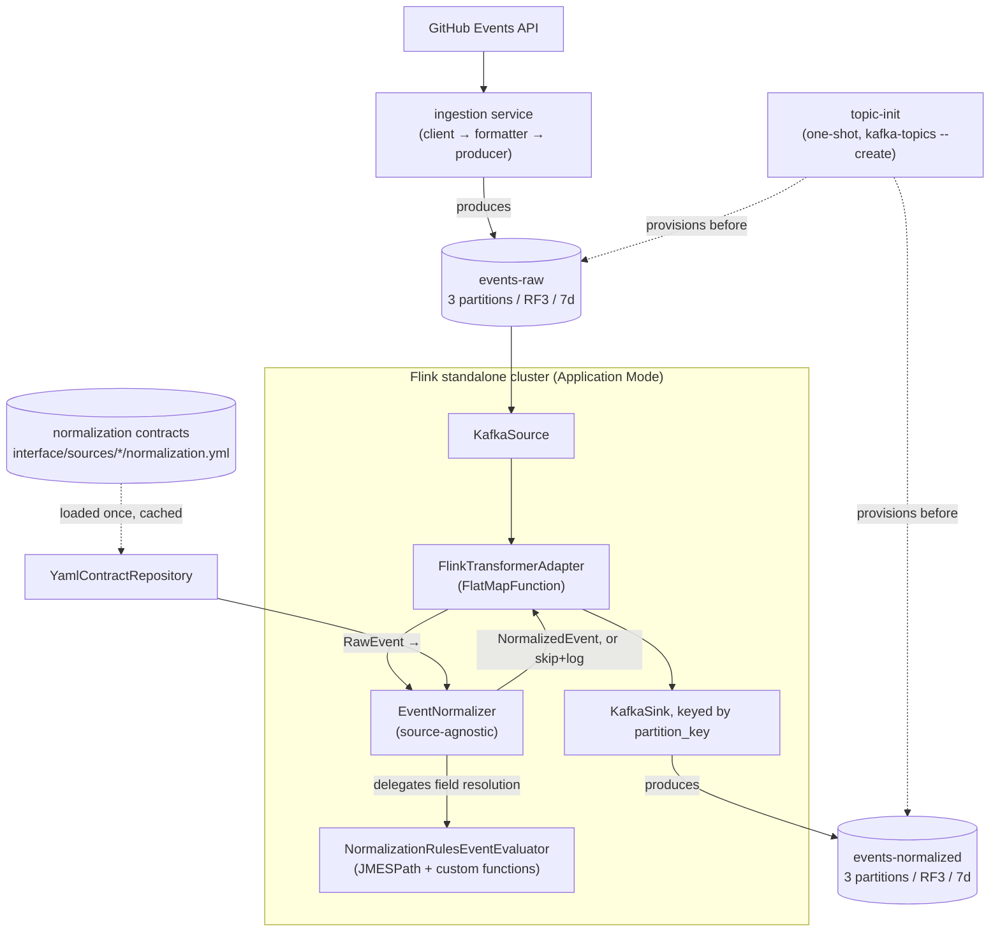

# Flink Normalization Design

**Spec**: `.specs/features/flink-normalization/spec.md`
**Context**: `.specs/features/flink-normalization/context.md`
**Platform vision**: `.specs/PLATFORM.md` (`AD-006`)
**Status**: Implemented. For task-by-task history and any open follow-up, see `tasks.md` and `.specs/STATE.md`'s Handoff.

---

## Architecture Overview

Two runtime pieces join the Kafka cluster alongside ingestion: a standalone PyFlink cluster running the normalization job, `flink.normalization`, in **Application Mode** - the job is embedded in the JobManager's entrypoint, so it starts the instant `docker compose up` runs, with no separate submission step (confirmed with the user 2026-08-10; a session-cluster-plus-submitter alternative is recorded in `context.md` as a possible future improvement, not built).

Data flow: `GitHub Events API → ingestion (client → formatter → producer, unchanged) → events-raw → Flink (KafkaSource → FlinkTransformerAdapter → KafkaSink) → events-normalized, keyed by partition_key`.

**Normalization is contract-driven** (`AD-006`, `.specs/PLATFORM.md`). There is no hand-written
`GitHubNormalizer` with one Python method per event type. Instead, a single source-agnostic
`EventNormalizer` interprets a YAML contract that declares, per source and per event type, which
output field comes from which input path. Adding an event type - or a whole new source - is a YAML
edit, not a Python change. The declared paths compile to JMESPath expressions evaluated against
`RawEvent.payload`.



---

## Code Reuse Analysis

### Existing Components to Leverage

| Component | Location | How to Use |
| --- | --- | --- |
| `RawEvent` | `shared/models.py` | Imported directly as the Flink job's input contract - not redefined. `RawEvent.payload` holds the whole source event dict (`actor`, `repo`, `org`, `created_at`, `public`, and the source's own nested `payload`), which is the root every contract path is evaluated against. |
| YAML-config-plus-Pydantic-validator pattern | `ingestion/models.py` + `interface/sources/<name>/ingestion.yml` | The direct precedent for this feature's contract layer: a Pydantic model validates each YAML entry, one cached repository reads the file once, and a lookup resolves an entry by name. The normalization contract (`interface/sources/<name>/normalization.yml`) is the same idea applied to field mapping instead of endpoints. |
| Dotted-path field resolution | `ingestion/models.py` (`SourceConfig._get_nested_value`) | Conceptually extended, not imported: ingestion needed two hardcoded single-value paths, so a hand-rolled `split(".")` walk was enough. Normalization needs list projection, defaults, and presence checks, so the same idea is delegated to JMESPath instead (see Tech Decisions). |
| ABC + constructor-injection port/domain-ABC pattern | `ingestion/ports.py`, `ingestion/domain/__init__.py` | Applied identically to `TransformerPort` (`flink/normalization/ports.py`) and `ContractRepository`/`EventEvaluator` (`flink/normalization/domain/__init__.py`). |
| Log-and-skip validation pattern | `ingestion/domain/formatter.py` | Mirrored in `FlinkTransformerAdapter.flat_map` for malformed messages / unregistered source / normalization failures. |
| Per-class logger convention | `shared/logger.py` | Reused as-is in every new module (`getLogger(self.__class__.__name__)`). |
| `infra/docker/docker-compose.yml` | `infra/docker/docker-compose.yml` | Extended in place - new services added alongside the existing controllers/brokers/kafka-ui, not a new compose file. |
| `.env` / `KAFKA_BOOTSTRAP_SERVERS` convention | `ingestion/adapters/producer.py`, `ingestion/app.py` | Same env var read by `flink/normalization/app.py` for its Kafka source/sink bootstrap servers. |

### Integration Points

| System | Integration Method |
| --- | --- |
| `events-raw` (Kafka) | PyFlink `KafkaSource` (`flink/common/adapters/source.py`), dedicated consumer group `normalization-consumer-group` |
| `events-normalized` (Kafka) | PyFlink `KafkaSink` (`flink/common/adapters/sink.py`), key/value both extracted from the `Row` yielded by `FlinkTransformerAdapter` (key = `partition_key`, value = the serialized `NormalizedEvent`) |
| Existing ingestion service | A docker-compose service producing to the same `events-raw` topic it already writes to - no code change to `ingestion/` itself |

---

## Components

### `TransformerPort` (port)

- **Purpose**: Abstract contract for a Flink `FlatMapFunction`-shaped transform - one input event in, zero or more output events out.
- **Location**: `flink/normalization/ports.py`
- **Interfaces**:
  - `flat_map(self, value: Any) -> Iterable[Any]`
- **Dependencies**: none (pure interface)
- **Reuses**: Same ABC + per-class-logger shape as `ingestion/ports.py`

### `EventNormalizer`

- **Purpose**: The single, source-agnostic orchestrator this feature builds. Resolves the contract for an event's source, delegates field resolution to the injected `EventEvaluator`, and assembles the `NormalizedEvent`. Contains **no** GitHub-specific logic, no per-event-type methods, and no `if source == ...` branching.
- **Location**: `flink/normalization/domain/normalizer.py`
- **Interfaces**:
  - `normalize(self, event: RawEvent) -> NormalizedEvent`
- **Behavior**:
  1. Resolve the contract for `event.source` via the injected `ContractRepository`.
  2. Delegate to `EventEvaluator.apply(event, contract)` to resolve every declared field (envelope + common + per-event-type block, falling back to an empty per-type block when `event.source_event_type` isn't declared - spec.md P1 AC5, the event still publishes).
  3. Build and return a `NormalizedEvent`: the Domain-Neutral Envelope fields plus any source-specific extras as opaque additional fields.
- **Dependencies**: `EventEvaluator`, `ContractRepository`, `shared.models.RawEvent`
- **Reuses**: `spec.md`'s Normalization Mapping table remains the binding contract for *what* the fields are - it is the content of the YAML files, not of Python methods.

### `NormalizationRulesEventEvaluator`

- **Purpose**: Compiles each contract field declaration into a JMESPath expression and evaluates it against `RawEvent.payload`.
- **Location**: `flink/normalization/domain/evaluator.py`
- **Interfaces**: `apply(self, event: RawEvent, contract: NormalizationContract) -> dict[str, Any]`, satisfies `EventEvaluator`.
- **Compilation rule** - each field declaration translates to exactly one JMESPath expression:

  | Contract declaration | Compiles to | Verified |
  | --- | --- | --- |
  | `from: actor.id` | `actor.id` | ✅ `181008794` |
  | `from: payload.issue.labels` + `take: name` | `payload.issue.labels[].name` | ✅ list of label names |
  | `from: payload.issue.pull_request` + `as: boolean` | ``payload.issue.pull_request != `null` `` | ✅ `True` |
  | `from: created_at` + `as: timestamp` | `iso_to_millis(created_at)` (custom function) | ✅ `1784290892000` |
  | `from: org.id` + `default: null` | native null-on-missing, or `\|\|` when a non-null default is given | ✅ returns `None`, never raises |
  | `expression: <raw>` | passed through verbatim | escape hatch, `AD-006` |

- **Reuses**: the `ingestion/models.py` YAML-plus-Pydantic shape, applied to a richer schema.
- **Note**: the vocabulary (`take:`, `as:`) exists to keep JMESPath syntax out of the user's way, not to add capability - every row above except `as: timestamp` is native engine behavior (see `.specs/PLATFORM.md`, verified findings).

### `YamlContractRepository`

- **Purpose**: Reads and validates the per-source YAML contract, caching it per source so it is loaded once, not per message.
- **Location**: `flink/normalization/domain/contract_repository.py`
- **Interfaces**: `get(self, source: str) -> NormalizationContract`, satisfies `ContractRepository`. Raises `NotImplementedError` for a source with no contract file.
- **Reuses**: `ingestion/domain/source_config_repository.py`'s YAML-plus-Pydantic-plus-cache shape.

### Normalization contracts (the YAML itself)

- **Purpose**: The user-authored declaration. One file per source.
- **Location**: `interface/sources/<source>/normalization.yml` (e.g. `interface/sources/github/normalization.yml`)
- **Shape** (illustrative - the authoritative field list stays `spec.md`'s Normalization Mapping table):

```yaml
source: github
partition_key: { from: repo.name }

envelope:
  entity_id:   { from: actor.id }
  entity_name: { from: actor.login }
  event_time:  { from: created_at, as: timestamp }

common:                      # applies to every event type of this source
  repo_id:   { from: repo.id }
  repo_name: { from: repo.name }
  org_id:    { from: org.id, default: null }
  org_login: { from: org.login, default: null }
  public:    { from: public }

event_types:
  IssueCommentEvent:
    action:                { from: payload.action }
    issue_id:              { from: payload.issue.id }
    issue_labels:          { from: payload.issue.labels, take: name }
    issue_is_pull_request: { from: payload.issue.pull_request, as: boolean }
    comment_body:          { from: payload.comment.body }
  # ... the remaining declared types
```

- **Note on paths**: every path is evaluated against `RawEvent.payload`, which is the whole source event dict. GitHub's own nested `payload` object is therefore reached as `payload.<...>`, while `actor`/`repo`/`org`/`created_at`/`public` sit at the root - matching the shapes verified against real captured GitHub traffic (inlined in `tests/fixtures/events.py`).

### `FlinkTransformerAdapter` (Flink `FlatMapFunction`)

- **Purpose**: The only Flink-aware piece of business logic. Parses/validates the raw Kafka message into a `RawEvent`, delegates to `EventNormalizer`, and yields a `Row(key, value)` - or yields nothing (logging why) on any failure. A **`FlatMapFunction`**, not a `MapFunction`, specifically because "skip this message" (zero output records) is a required outcome (spec.md P1 Normalization AC6) that a `MapFunction` cannot express.
- **Location**: `flink/normalization/adapters/transformer.py`
- **Interfaces**: `flat_map(self, value: str) -> Iterator[Row]`, satisfies `TransformerPort`.
- **Behavior**:
  1. Parse `value` as JSON and validate against `RawEvent`. On failure: log and yield nothing.
  2. Call `normalizer.normalize(event)`. If no contract is declared for `event.source` (`NotImplementedError`), or normalization otherwise fails: log and yield nothing.
  3. Encode the `NormalizedEvent`'s `partition_key` as the key and its JSON serialization as the value, and `yield Row(key, value)`.
- **Dependencies**: `RawEvent`, `EventNormalizer`, `shared.logger`
- **Reuses**: Same log-and-skip shape as `ingestion/domain/formatter.py`'s event validation.

### Job wiring (`flink/normalization/app.py`)

- **Purpose**: Builds the `StreamExecutionEnvironment`, wires `KafkaSource(events-raw) → FlinkTransformerAdapter → KafkaSink(events-normalized, keyed by partition_key)`, and executes the job. This is the Application Mode entrypoint (`standalone-job -py .../flink/normalization/app.py`).
- **Location**: `flink/normalization/app.py`
- **Dependencies**: PyFlink (`pyflink.datastream`, `pyflink.datastream.connectors.kafka`), `flink.common.KafkaFactory`, Flink's Kafka connector JAR (added to the image's `/opt/flink/lib`, not a `pip` package - PyFlink connectors need the Java connector on the classpath)
- **Reuses**: `.env`/`load_dotenv()` + `KAFKA_BOOTSTRAP_SERVERS` convention already used by `ingestion/app.py`. `flink/common`'s `KafkaFactory`/`KafkaSourceParams`/`KafkaSinkParams` (shared with `flink/analytics/`) for building the source/sink instead of hand-rolling PyFlink connector setup per job.

### Docker / compose

| File | Purpose |
| --- | --- |
| `flink/normalization/Dockerfile` | `FROM flink:2.3.0-scala_2.12-java17`; installs Python 3 + `requirements/flink.txt`; adds the Flink SQL Kafka connector JAR; copies `flink/common/`, `flink/normalization/`, `shared/`, and `interface/` into the image's usrlib path |
| `ingestion/Dockerfile` | Slim Python base; installs `requirements/ingestion.txt`; `CMD ["python", "-m", "ingestion.app", "--source", "github"]` |
| `infra/docker/scripts/create-topics.sh` | One-shot script: retries `kafka-topics.sh --create` for `events-raw`/`events-normalized` (3 partitions, RF3, 7-day retention) against the brokers until they accept connections, then exits 0 |
| `infra/docker/docker-compose.yml` | `topic-init`, `ingestion`, `normalization` (jobmanager, Application Mode), `taskmanager-normalization` services. Startup ordering: brokers → `topic-init` → `ingestion`/`normalization` → `taskmanager-normalization` |

---

## Data Models

### Domain-Neutral Envelope (see `spec.md` Normalization Mapping for the authoritative field table)

```python
class EventEvaluator(ABC):
    @abstractmethod
    def apply(self, event: RawEvent, contract: NormalizationContract) -> dict[str, Any]:
        """Resolve every field a contract declares against event.payload."""


class NormalizedEvent(BaseModel):
    model_config = ConfigDict(extra="allow")
    source: str
    event_id: str
    event_type: str
    ingested_at: datetime
    schema_version: int
    partition_key: str
    entity_id: str
    entity_name: str
    event_time: int
```

**Relationships**: `RawEvent` (input, `shared/models.py`, unchanged) → `EventNormalizer.normalize()` → `NormalizedEvent` (output, serialized to JSON and published to `events-normalized`, keyed by `partition_key`). Source-specific fields ride along as extra, opaque keys on `NormalizedEvent` (`ConfigDict(extra="allow")`) - the contract determines which exist, not this model.

### Contract models

Pydantic models validate the *contract*, not the event. This is the one place Pydantic classes are
added for this feature - written by developers to define the contract's grammar, never instantiated
by the user, who only writes YAML (`AD-006`).

```python
class FieldRule(BaseModel):
    model_config = ConfigDict(extra="forbid")
    from_: str | None = Field(default=None, alias="from")
    take: str | None = None          # pluck this attribute from a list of objects
    as_: Literal["boolean", "timestamp"] | None = Field(default=None, alias="as")
    default: Any = None
    expression: str | None = None    # raw-JMESPath escape hatch (AD-006)


class NormalizationContract(BaseModel):
    source: str
    partition_key: FieldRule
    envelope: dict[str, FieldRule]
    common: dict[str, FieldRule]
    event_types: dict[str, dict[str, FieldRule]]
```

**Validation is the platform's contract with a non-technical author**: an unknown key, a missing
`from`/`expression`, an unsupported `as:` value, or a syntactically invalid raw expression fails
loudly at load time with a message naming the file, the event type, and the field - never silently at
runtime. `as_` being a `Literal` rather than a free string is what makes a typo a startup error
instead of a null column.

**Deliberately not built**: a class hierarchy the user instantiates. The models above are a grammar
for validating data, not an object model the user assembles (`AD-006`).

---

## Error Handling Strategy

| Error Scenario | Handling | Impact |
| --- | --- | --- |
| Malformed JSON / invalid `RawEvent` | `FlinkTransformerAdapter.flat_map` logs and yields nothing | Message dropped from `events-normalized`; visible in TaskManager logs (spec.md P1 Normalization AC6) |
| `source_event_type` not declared under `event_types` in the contract | `EventNormalizer`/`NormalizationRulesEventEvaluator` return envelope + common block + empty per-type block - not skipped | Event still appears on `events-normalized` with an empty source-specific block (spec.md P1 Normalization AC5) |
| `event.source` has no contract file (e.g. a hypothetical non-GitHub `RawEvent`) | `YamlContractRepository.get` raises `NotImplementedError`, caught and logged by `FlinkTransformerAdapter` | Message dropped, logged as a warning - closes a gap `spec.md`'s ACs didn't explicitly cover (see Risks & Concerns) |
| Contract declares a path absent from this particular payload | JMESPath returns `null` - verified, does not raise | That output field is `null`; the record still publishes. A contract pointing at an optional field degrades gracefully rather than killing the record |
| Contract itself is invalid (unknown key, bad `as:`, malformed raw expression) | Pydantic validation fails at **job startup**, before any message is consumed | Job refuses to start with a message naming file/event type/field. Deliberately fail-fast: a silently-wrong contract would corrupt every downstream record |
| Kafka broker unreachable at job startup | Flink's own `KafkaSource` reconnect behavior (default) | Job may sit retrying until Kafka is reachable; no custom handling built - job-level restart-strategy tuning is Out of Scope for this feature |

---

## Risks & Concerns

| Concern | Location | Impact | Mitigation |
| --- | --- | --- | --- |
| JVM/Flink dependencies don't fit one flat dependency file shared by every target | `requirements/`, `Makefile` | `apache-flink` pulls in Py4J and expects a compatible Java runtime; installing it into the ingestion image (or vice versa) would bloat both | Dependencies split per target under `requirements/` (`base` → `ingestion`/`flink` → `dev`), so each image installs only what it runs. Every `pyflink` import stays confined to `adapters/transformer.py`/`app.py` - `ports.py`, `models.py`, and `domain/` stay pure Python, so `make test` covers them like `ingestion/` today, no JVM needed. |
| `spec.md`'s ACs cover "malformed message" and "unmapped event type," but not "valid `RawEvent`, source has no registered contract at all" | `flink/normalization/domain/contract_repository.py` | Undefined behavior for a hypothetical non-GitHub `RawEvent` on `events-raw` (GitLab isn't wired for ingestion, so low real probability, but the code needs defined behavior) | Treated identically to the malformed-message log-and-skip path (extends AC6's spirit). Documented here since it wasn't explicit in `spec.md`. |
| A contract typo produces a silently-null column instead of an error - the classic failure mode of config-driven platforms, and the main risk `AD-006` introduces | `interface/sources/*/normalization.yml` | A non-technical author gets a normalized stream that looks fine but is missing data, with nothing pointing at the mistake | Two-layer mitigation: (1) Pydantic rejects unknown/invalid keys at startup (`as_` is a `Literal`, not a free string); (2) a contract-linting step against a real sample payload (the captured events in `tests/fixtures/events.py`) is a natural follow-up, deliberately not scoped into this feature. |
| `jmespath` is a new runtime dependency reaching a JVM-hosted Python environment | `requirements/flink.txt`, `flink/normalization/Dockerfile` | The Flink image must install it or the job fails at import inside the TaskManager, not locally | Pure-Python package with no native extensions, so no cross-platform build risk. Pinned in `requirements/flink.txt`. |
| Contracts are read at job startup, so editing one requires restarting the job | `flink/normalization/app.py` | A user who edits a contract sees no effect until redeploy - acceptable for files-in-git, but a blocker for the eventual self-service UI | Accepted for this increment and recorded in `.specs/PLATFORM.md`'s open question. Flink's Broadcast State pattern is the known answer when hot reload is actually needed; not built now |

---

## Tech Decisions (only non-obvious ones)

| Decision | Choice | Rationale |
| --- | --- | --- |
| Flink version | `2.3.0` (current stable at the time) | DataStream API (`map`/`flatMap`/`filter`/`keyBy`/`process`) remains fully supported in Flink 2.x |
| Flink API style | DataStream API with a custom `FlatMapFunction`, not Table API/SQL | Flattening deeply nested, per-type-varying JSON is genuinely awkward in SQL, and each input record maps to zero-or-one output record with no relational operation involved. Per `AD-006`, this is a per-stage choice, not project-wide: aggregation (`flink/analytics/`) compiles to Flink Table API/SQL instead, since group-by + windowing *is* relational. See `.specs/PLATFORM.md`. |
| Field-extraction engine | JMESPath (`jmespath==1.1.0`), pinned in `requirements/flink.txt` | Hand-rolling list projection, presence checks, and defaults would mean growing `SourceConfig._get_nested_value` into a small expression language. JMESPath already is one, is widely known (AWS CLI `--query`, Ansible), and supports registering custom functions for the one case it lacks (ISO→epoch millis). All claims verified hands-on against real captured GitHub traffic before adopting - see `.specs/PLATFORM.md`. |
| Contract vocabulary vs. raw expressions | Friendly keys (`from:`, `take:`, `as:`) compiled to JMESPath, plus one `expression:` escape hatch | `AD-006`'s tier rule. A non-technical author never needs to learn `[].name` or ``!= `null` ``; a power user is never blocked. Confining raw power to a single documented key prevents the schema from growing conditionals and loops. |
| Contract compilation timing | Once at job startup, not per message | The job is a continuously-running stream; recompiling an expression per record would be pure waste. Also makes contract errors a startup failure rather than a per-message runtime error. |
| Job deployment mode | **Application Mode** (`standalone-job -py app.py` as the JobManager's entrypoint command) | Confirmed with the user 2026-08-10: satisfies "one `docker compose up` brings up everything" (spec P1 Infra AC2) with the fewest moving parts. A session-cluster-plus-submitter alternative was explicitly requested to be recorded as a future improvement, not built now - see `context.md` Deferred Ideas. |
| `pyflink` import boundary | Confined to `adapters/transformer.py`/`app.py` only | Keeps every other new module testable in the existing `.venv` without a JVM dependency (see Risks & Concerns) |
| Normalizer dispatch | Contract lookup by source name, not a registry dict of classes | Under `AD-006` there is one normalizer class for all sources; what is looked up is the *contract*, mirroring `ingestion.models.SourceConfig`'s YAML lookup. |
| Unregistered-source handling | Log + skip, same path as malformed messages | Closes a gap `spec.md`'s ACs didn't explicitly enumerate (see Risks & Concerns) |
| Contract storage | YAML files in the repo, not a database | `AD-006`: the contract *format* is the API; storage is a client of it. Files give versioning and review free via git at zero infra cost. A database + UI is a later increment and changes where the bytes live, not the format. |

> **Project-level decisions**: this design is the first implementation of `AD-006` (contract-driven
> configuration, `.specs/PLATFORM.md`) and carries an amendment to `AD-004`'s "one implementation per
> source" mechanism - see `.claude/rules/architecture.md`. The remaining rows above are feature-local
> implementation strategy.
