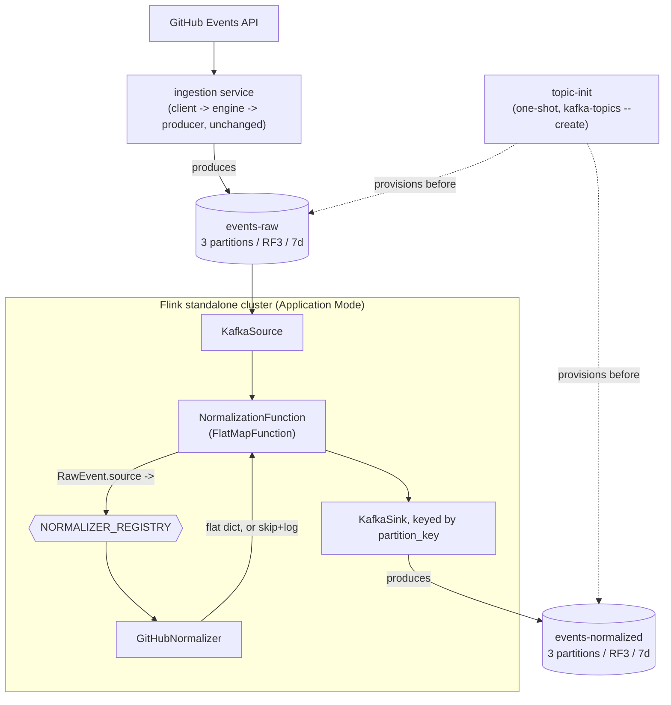

# Flink Normalization Design

**Spec**: `.specs/features/flink-normalization/spec.md`
**Context**: `.specs/features/flink-normalization/context.md`
**Status**: Draft

---

## Architecture Overview

Two new runtime pieces join the existing 3-controller/3-broker Kafka cluster: the ingestion service (containerized for the first time) and a standalone PyFlink cluster running one job, `flink.normalization`, in **Application Mode** - the job is embedded in the JobManager's entrypoint, so it starts the instant `docker compose up` runs, with no separate submission step (confirmed with the user 2026-08-10; a session-cluster-plus-submitter alternative is recorded as a future improvement, not built now - see Tech Decisions and `context.md`).

Data flow: `GitHub Events API → ingestion (client/engine/producer, unchanged) → events-raw → Flink (KafkaSource → NormalizationFunction → KafkaSink) → events-normalized, keyed by partition_key`.



---

## Code Reuse Analysis

### Existing Components to Leverage

| Component | Location | How to Use |
| --- | --- | --- |
| `RawEvent`, `SourceType`, `GitHubEventType`, `GitHubEvent` | `ingestion/models.py` | Imported directly as the Flink job's input contract - not redefined. `RawEvent.payload` is already a validated `GitHubEvent.model_dump(mode="json")`, so the normalizer reads real, already-typed field names. |
| ABC + constructor-injection port pattern | `ingestion/ports.py` | Applied identically to `NormalizerBase` - one abstract method, docstring-documented like `IngestionEngineBase`. |
| Registry-dict-over-if/elif pattern | `ingestion/models.py` (`SOURCE_REGISTRY`, `get_source_config`) | Mirrored as `NORMALIZER_REGISTRY` in `flink/normalization/models.py`. |
| Log-and-skip validation pattern | `ingestion/adapters/engine.py` (`_format_events`) | Mirrored in `NormalizationFunction.flat_map` for malformed messages / unknown `schema_version` / unregistered source. |
| Per-class logger convention | `shared/logger.py` | Reused as-is in every new module (`getLogger(self.__class__.__name__)`). |
| `infra/docker/docker-compose.yml` | `infra/docker/docker-compose.yml` | Extended in place - new services added alongside the existing controllers/brokers/kafka-ui, not a new compose file. |
| `.env` / `KAFKA_BOOTSTRAP_SERVERS` convention | `ingestion/adapters/producer.py`, `ingestion/app.py` | Same env var read by the Flink job's `app.py` for its Kafka source/sink bootstrap servers. |
| Makefile `@echo` + one-liner target style | `Makefile` | New targets (e.g. `stack-up`) follow the same shape as `kafka-up`/`ingestion-default`. |

### Integration Points

| System | Integration Method |
| --- | --- |
| `events-raw` (Kafka) | PyFlink `KafkaSource`, dedicated consumer group (e.g. `flink-normalization`), starting offset configurable (latest by default for a continuously-running job) |
| `events-normalized` (Kafka) | PyFlink `KafkaSink`, message key = `partition_key` via `KafkaRecordSerializationSchema`'s key extractor, value = flat JSON string |
| Existing ingestion service | Becomes a docker-compose service producing to the same `events-raw` topic it already writes to today - **no code change to `ingestion/` itself** |

---

## Components

### `NormalizerBase` (port)

- **Purpose**: Abstract contract for turning a validated `RawEvent` into the pipeline's flat normalized record - one implementation per source, per `AD-004`.
- **Location**: `flink/normalization/ports.py`
- **Interfaces**:
  - `normalize(self, event: RawEvent) -> dict[str, Any]` - returns the flat normalized record (Domain-Neutral Envelope fields + source-specific fields). Never raises for a structurally valid `RawEvent`; never returns `None` - an event of an unmapped type still returns a full record with empty source-specific fields (spec.md P1 Normalization AC5).
- **Dependencies**: `ingestion.models.RawEvent`
- **Reuses**: Same ABC shape as `IngestionEngineBase`/`IngestionClientBase`/`IngestionProducerBase` in `ingestion/ports.py`

### `GitHubNormalizer`

- **Purpose**: The sole concrete `Normalizer` this feature builds. Implements the full Normalization Mapping table from `spec.md` for the 11 covered `GitHubEventType` values, and the envelope-only fallback for the other 6.
- **Location**: `flink/normalization/adapters/github_normalizer.py`
- **Interfaces**:
  - `normalize(self, event: RawEvent) -> dict[str, Any]`
  - Internally organized as one private extraction method per `GitHubEventType` (e.g. `_extract_issue_comment`, `_extract_pull_request`, `_extract_watch`, ...), dispatched by `event.source_event_type` - keeps each type's extraction independently unit-testable against `tmp/event_sample.json` fixtures, and gives the P2 story (6 remaining types) a slot to add one method at a time instead of touching shared logic.
  - A shared private helper extracts the GitHub-specific common block (`repo_id`, `repo_name`, `org_id`, `org_login`, `public`) once, since it's identical across all 17 types (top-level `GitHubEvent` fields, not `payload`).
- **Dependencies**: `ingestion.models.RawEvent`, `GitHubEventType`
- **Reuses**: The exact field lists and noise-filtering convention already fixed in `spec.md`'s Normalization Mapping table - that table is the source of truth for this component's behavior, not a re-derivation.

### `NORMALIZER_REGISTRY`

- **Purpose**: `SourceType → Normalizer` lookup.
- **Location**: `flink/normalization/models.py`
- **Shape**: `NORMALIZER_REGISTRY: dict[SourceType, NormalizerBase] = {SourceType.GITHUB: GitHubNormalizer()}`
- **Reuses**: Same registry-dict pattern as `ingestion/models.py`'s `SOURCE_REGISTRY`/`get_source_config` - adding a second source later is one dict entry, not a branch.

### `NormalizationFunction` (Flink `FlatMapFunction`)

- **Purpose**: The only Flink-aware piece of business logic. Parses/validates the raw Kafka message into a `RawEvent`, resolves the right `Normalizer` from `NORMALIZER_REGISTRY`, and yields the flat normalized JSON string - or yields nothing (logging why) on any failure. A **`FlatMapFunction`**, not a `MapFunction`, specifically because "skip this message" (zero output records) is a required outcome (spec.md P1 Normalization AC6) that a `MapFunction` cannot express (it must always emit exactly one record).
- **Location**: `flink/normalization/job.py`
- **Interfaces**:
  - `flat_map(self, value: str) -> Iterator[str]`
- **Behavior** (described at signature level; body is implementation, left to Execute):
  1. Parse `value` as JSON and validate against `RawEvent`. On failure (bad JSON, missing field, or `schema_version != 1`): log and yield nothing.
  2. Look up `NORMALIZER_REGISTRY.get(event.source)`. If no normalizer is registered for that source: log and yield nothing (a gap spec.md didn't explicitly enumerate - closed here, see Risks & Concerns).
  3. Call `normalizer.normalize(event)`, `json.dumps` the result, `yield` it.
- **Dependencies**: `RawEvent`, `NORMALIZER_REGISTRY`, `shared.logger`
- **Reuses**: Same log-and-skip shape as `ingestion/adapters/engine.py`'s `_format_events`

### Job wiring (`flink/normalization/app.py`)

- **Purpose**: Builds the `StreamExecutionEnvironment`, wires `KafkaSource(events-raw) → NormalizationFunction → KafkaSink(events-normalized, keyed by partition_key)`, and executes the job. This is the Application Mode entrypoint (`standalone-job -py /opt/flink/usrlib/app.py`).
- **Location**: `flink/normalization/app.py`
- **Dependencies**: PyFlink (`pyflink.datastream`, `pyflink.datastream.connectors.kafka`), `job.NormalizationFunction`, Flink's Kafka connector JAR (added to the image's `/opt/flink/lib`, not a `pip` package - PyFlink connectors need the Java connector on the classpath)
- **Reuses**: `.env`/`load_dotenv()` + `KAFKA_BOOTSTRAP_SERVERS` convention already used by `ingestion/app.py`/`ingestion/adapters/producer.py`

### Docker / compose additions

| File | Purpose |
| --- | --- |
| `infra/docker/flink/Dockerfile` | `FROM flink:2.3.0-scala_2.12-java17`; installs Python 3.12 + `apache-flink==2.3.0`; adds the Flink Kafka connector JAR; copies `flink/normalization/` and `ingestion/models.py` (its only cross-package dependency) into the image's usrlib path |
| `ingestion/Dockerfile` | Slim Python base; installs `requirements.txt`; `CMD ["python", "-m", "ingestion.app", "--source", "github"]` |
| `infra/docker/scripts/create-topics.sh` | One-shot script: retries `kafka-topics.sh --create` for `events-raw`/`events-normalized` (3 partitions, RF3, 7-day retention) against `broker-1:19092` until brokers accept connections, then exits 0 |
| `infra/docker/docker-compose.yml` | Extended (not replaced): new `topic-init`, `ingestion`, `flink-jobmanager`, `flink-taskmanager` services. Startup ordering: brokers → `topic-init` → {`ingestion`, `flink-jobmanager`} → `flink-taskmanager` |

---

## Data Models

### Domain-Neutral Envelope (see `spec.md` Normalization Mapping for the authoritative field table)

```python
class NormalizerBase(ABC):
    @abstractmethod
    def normalize(self, event: RawEvent) -> dict[str, Any]:
        """Flatten a validated RawEvent into the pipeline's common normalized record.

        Args:
            event (RawEvent): A structurally valid RawEvent (already deserialized
                and schema_version-checked by the caller).

        Returns:
            dict[str, Any]: The Domain-Neutral Envelope fields plus this source's
                fields block. Always returns a full record, even for an
                event_type this normalizer doesn't yet have a specific mapping
                for (envelope populated, source-specific fields empty/null).
        """
```

**Relationships**: `RawEvent` (input, `ingestion/models.py`, unchanged) → `NormalizerBase.normalize()` → flat `dict[str, Any]` (output, serialized to JSON and published to `events-normalized`). No new Pydantic model is introduced for the output shape itself - whether `GitHubNormalizer` builds that dict via per-type Pydantic models or plain dict-building functions is an Execute-time implementation choice; `spec.md`'s Normalization Mapping table is the binding contract either way.

---

## Error Handling Strategy

| Error Scenario | Handling | Impact |
| --- | --- | --- |
| Malformed JSON / invalid `RawEvent` | `NormalizationFunction.flat_map` logs and yields nothing | Message dropped from `events-normalized`; visible in TaskManager logs (spec.md P1 Normalization AC6) |
| `schema_version != 1` | Same | Same |
| `source_event_type` not yet in the Normalization Mapping table (the 6 P2 types) | `GitHubNormalizer.normalize` returns envelope + empty fields block - **not skipped** | Event still appears on `events-normalized` with an empty source-specific block (spec.md P1 Normalization AC5) |
| `event.source` has no entry in `NORMALIZER_REGISTRY` (e.g. a hypothetical non-GitHub `RawEvent`) | Logged and skipped, same path as malformed messages | Message dropped, logged as a warning - closes a gap `spec.md`'s ACs didn't explicitly cover (see Risks & Concerns) |
| Kafka broker unreachable at job startup | Flink's own `KafkaSource` reconnect behavior (default) | Job may sit retrying until Kafka is reachable; no custom handling built here - job-level restart-strategy tuning is Out of Scope for this feature |

---

## Risks & Concerns

| Concern | Location | Impact | Mitigation |
| --- | --- | --- | --- |
| JVM/Flink dependencies don't fit the project's single flat `requirements.txt` + `.venv` convention | `requirements.txt`, `Makefile` | `apache-flink` pulls in Py4J and expects a compatible Java runtime; `make test`/`make neat` currently scope only to `shared ingestion tests` | Every `pyflink` import stays confined to `flink/normalization/job.py` and `app.py`. `ports.py`, `models.py`, and `adapters/github_normalizer.py` stay pure Python, so `make test` covers them exactly like `ingestion/` today, no JVM needed. Tasks phase updates the `test`/`neat` Makefile targets to include `flink`. |
| Exact Flink Application Mode CLI/entrypoint flags for a Python job (`standalone-job -py ...`) were researched via docs/search, not hands-on verified in this repo | `infra/docker/flink/Dockerfile`, compose service definition (Tasks phase) | The first `docker compose up` attempt may need iteration on the jobmanager command before the job actually submits | Flagged per Knowledge Verification Chain Step 5. First Tasks-phase task for this piece should budget for iteration, not assume one-shot success. |
| `spec.md`'s ACs cover "malformed message" and "unmapped event type," but not "valid `RawEvent`, source has no registered `Normalizer` at all" | `flink/normalization/job.py` (planned) | Undefined behavior for a hypothetical non-GitHub `RawEvent` on `events-raw` today (GitLab isn't wired for ingestion, so low real probability, but the code needs defined behavior) | Closed at Design time: treated identically to the malformed-message log-and-skip path (extends AC6's spirit). Documented here since it wasn't explicit in `spec.md`. |
| `streaming-ingestion/spec.md` names the producer component `IngestionPublisher`; the actual code is `IngestionProducerBase`/`IngestionProducer` | `ingestion/ports.py:33`, `ingestion/adapters/producer.py:18` | Minor, pre-existing spec/code naming drift, unrelated to this feature | Out of scope to fix here; noted for a future spec sync on `streaming-ingestion` |

> No security, performance, or test-coverage-gap concerns beyond the above were found while researching this feature's touch points.

---

## Tech Decisions (only non-obvious ones)

| Decision | Choice | Rationale |
| --- | --- | --- |
| Flink version | `2.3.0` (current stable, released June 2026) | Latest stable; DataStream API (`map`/`flatMap`/`filter`/`keyBy`/`process`) remains fully supported in Flink 2.x per research - no need to pin an older line |
| Flink API style | DataStream API with a custom `FlatMapFunction`, not Table API/SQL | Per-`GitHubEventType` field extraction is arbitrary Python branching logic, not a relational transformation - DataStream fits the actual shape of the work |
| Docker base image | `flink:2.3.0-scala_2.12-java17`, custom-built adding Python 3.12 + `apache-flink` | Verified as a real Docker Hub tag; Java 17 is a modern LTS choice, matches Flink 2.x's Python 3.12 default |
| Job deployment mode | **Application Mode** (`standalone-job -py app.py` as the JobManager's entrypoint command) | Confirmed with the user 2026-08-10: satisfies "one `docker compose up` brings up everything" (spec P1 Infra AC2) with the fewest moving parts. A session-cluster-plus-submitter alternative was explicitly requested to be recorded as a future improvement, not built now - see `context.md` Deferred Ideas. |
| `pyflink` import boundary | Confined to `job.py`/`app.py` only | Keeps every other new module testable in the existing `.venv` without a JVM dependency (see Risks & Concerns) |
| Normalizer dispatch | Registry dict (`NORMALIZER_REGISTRY`), not `if`/`elif` | Mirrors `ingestion/models.py`'s existing `SOURCE_REGISTRY`/`get_source_config` pattern exactly - adding a source later is a dict entry |
| Unregistered-source handling | Log + skip, same path as malformed messages | Closes a gap `spec.md`'s ACs didn't explicitly enumerate (see Risks & Concerns) |

> No new project-level convention beyond `AD-004` (already recorded) emerged here - the choices above are feature-local implementation strategy, not constraints future features must inherit.
